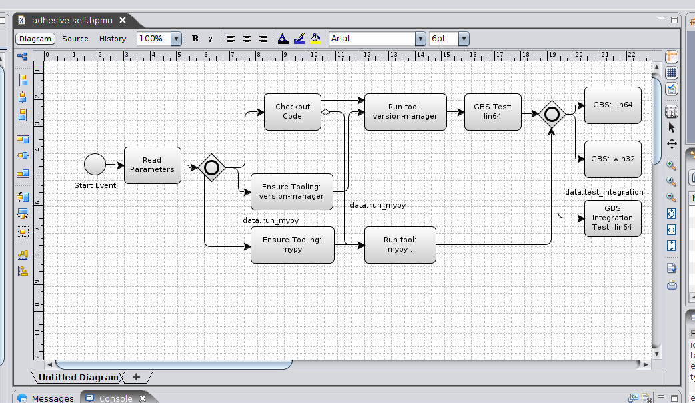
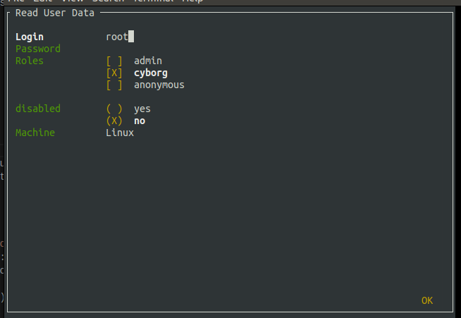

adhesive
========

A CI/CD system build around BPMN and Python. Basically a micro BPMN
runner with python step implementations targeted for builds. Able to run
in the terminal.

Installation
------------

.. code:: sh

    pip install adhesive

Getting Started
---------------

Simple Builds
~~~~~~~~~~~~~

To create a basic build you just create a file in your project named
``_adhesive.py``. In it you then declare some tasks. For example:

.. code:: py

    import adhesive

    @adhesive.task("Checkout Code")
    def checkout_code(context):
        adhesive.scm.checkout(context.workspace)

    @adhesive.task("Run Build")
    def run_build(context):
        context.workspace.run("mvn clean install")

    adhesive.build()

Since no process was defined, adhesive takes the defined tasks, stitches
them in order, and has a process defined as ``<start>`` ->
``Checkout Code`` -> ``Run Build`` -> ``<end>``.

To run it simply call ``adhesive`` in the terminal:

.. code:: sh

    adhesive

This is the equivalent of Jenkins stages. But we can do better:

Programmatic Builds
~~~~~~~~~~~~~~~~~~~

In order to use the full programmatic functionalities that adhesive
offers, you are able to stitch your BPM process manually. You have sub
processes, branching and looping available:

.. code:: py

    import adhesive
    import uuid

    @adhesive.task("Run in parallel")
    def context_to_run(context):
        if not context.data.executions:
            context.data.executions = set()

        context.data.executions.add(str(uuid.uuid4()))

    data = adhesive.process_start()\
        .branch_start()\
            .sub_process_start() \
                .task("Run in parallel",
                      loop="context.data.items") \
            .sub_process_end()\
        .branch_end() \
        .branch_start() \
            .sub_process_start() \
                .task("Run in parallel",
                      loop="context.data.items") \
            .sub_process_end() \
        .branch_end() \
        .process_end()\
        .build(initial_data={"items": [1, 2, 3, 4, 5]})

    assert len(data.executions) == 10

Here you see the full BPMN power starting to unfold. We create a process
that branches out, creates sub processes (sub processes can be looped as
a single unit). Loops are creating execution tokens that also run in
parallel in the same pool.

Note that you can pass ``initial_data`` into the process, and you can
also get the ``context.data`` from the last execution token.

BPMN Process
~~~~~~~~~~~~

Last but not least, adhesive reads BPMN files, and builds the process
graph from them. This is particularly good if the process is complex and
has a lot of dependencies:

   Image Description

The `build of adhesive <_adhesive.py>`__ is modeled as a `BPMN
process <adhesive-self.bpmn>`__ itself, so we load it from the file
directly using: ``adhesive.build_bpmn("adhesive-self.bpmn")``

.. code:: py

    import adhesive

    @adhesive.task("Read Parameters")
    def read_parameters(context) -> None:
        context.data.run_mypy = False
        context.data.test_integration = True

    @adhesive.task(r"^Ensure Tooling:\s+(.+)$")
    def gbs_ensure_tooling(context, tool_name) -> None:
        ge_tooling.ensure_tooling(context, tool_name)

    # ...

    adhesive.build_bpmn("adhesive-self.bpmn")

As you see steps are parametrizable, and use the data from the task name
into the step definition.

Defining BPMN Tasks
-------------------

For example here, we define an implementation of tasks:

.. code:: py

    @adhesive.task(r"^Ensure Tooling:\s+(.+)$")
    def gbs_ensure_tooling(context, tool_name) -> None:
        # ...

Or a user task (interactive form):

.. code:: py

    @adhesive.usertask('Publish to PyPI\?')
    def publish_to_pypi_confirm(context, ui):
        ui.add_checkbox_group(
            "publish",
            title="Publish",
            values=(
                ("nexus", "Publish to Nexus"),
                ("pypitest", "Publish to PyPI Test"),
                ("pypi", "Publish to PyPI"),
            ),
            value=("pypitest", "pypi")
        )

Don't forget, the ``@adhesive.task`` and ``@adhesive.usertask`` are just
defining mappings for implementations of the task names available in the
process, unless calling the ``adhesive.build()`` that creates a linear
process out of these tasks.

As you notice, there's always a first parameter named ``context``. The
``context`` parameter contains the following information:

1. ``task`` - the Task in the graph that's currently matched against
   this execution.
2. ``task_name`` - The resolved name, with the variables interpolated.
   Matching is attempted *after* the name is resolved.
3. ``data`` - Data that the current execution token contains. This data
   is always cloned across executions, and ``set``\ s and ``dict``\ s
   are automatically merged if multiple execution tokens are merged. So
   you have a modifiable copy of the data that you're allowed to change,
   and is propagated into the following execution tokens.
4. ``loop`` - if the current task is in a loop, the entry contains its
   ``index``, and a ``key`` and ``value``. Note that loop execution
   happens in parallel since these are simple execution tokens.
5. ``workspace`` - a way to interact with a system, and execute
   commands, create files, etc.

``adhesive`` runs all the tasks on a parallel process pool for better
performance. This happens automatically.

The tasks perform the actual work for the build. But in order to have
that, we need to be able to execute commands, and create files. For that
we have the ``workspace``.

Workspace
---------

Workspaces are just a way of interacting with a system, running
commands, and writing/reading files. Currently only
``LocalLinuxWorkspace`` and ``DockerWorkspace`` are implemented.

When starting ``adhesive`` allocates a default workspace folder in the
configured temp location (implicitly ``/tmp/adhesive``). The
``Workspace`` API is an API that allows you to run commands, and create
files, taking care of redirecting outputs, and even escaping the
commands to be able to easily run them inside docker containers.

Note that implicitly calling ``context.workspace.run(...)`` will run the
command on the host where adhesive is running.

To create a docker workspace that runs inside a container with the
tooling you just need to:

.. code:: py

    from adhesive.workspace import docker

Then to spin up a container that has the current folder mounted in,
where you're able to execute commands *inside* the container you just
need to:

.. code:: py

    @adhesive.task("Test")
    def gbs_test_linux(context) -> None:
        image_name = 'some-custom-python'

        with docker.inside(context.workspace, image_name) as w:
            w.run("python -m pytest -n 4")

This creates a workspace from our current context workspace, where we
simply execute what we want, using the ``run()`` method. If we're
interested in the program output we simply do a ``run`` with a
``capture_stdout`` that returns the output as a string.

Here's the full API for it:

.. code:: py

    class Workspace(ABC):
        """
        A workspace is a place where work can be done. That means a writable
        folder is being allocated, that might be cleaned up at the end of the
        execution.
        """

        @abstractmethod
        def write_file(
                self,
                file_name: str,
                content: str) -> None:
            pass

        @abstractmethod
        def run(self,
                command: str,
                capture_stdout: bool = False) -> Union[str, None]:
            """
            Run a new command in the current workspace.

            :param capture_stdout:
            :param command:
            :return:
            """
            pass

        @abstractmethod
        def rm(self, path: Optional[str]=None) -> None:
            """
            Recursively remove the file or folder given as path. If no path is sent,
            the whole workspace will be cleared.

            :param path:
            :return:
            """
            pass

        @abstractmethod
        def mkdir(self, path: str=None) -> None:
            """
            Create a folder, including all its needed parents.

            :param path:
            :return:
            """
            pass

        @abstractmethod
        def copy_to_agent(self,
                          from_path: str,
                          to_path: str) -> None:
            """
            Copy the files to the agent from the current disk.
            :param from_path:
            :param to_path:
            :return:
            """
            pass

        @abstractmethod
        def copy_from_agent(self,
                            from_path: str,
                            to_path: str) -> None:
            """
            Copy the files from the agent to the current disk.
            :param from_path:
            :param to_path:
            :return:
            """
            pass

        @contextmanager
        def temp_folder(self):
            """
            Create a temporary folder in the current `pwd` that will be deleted
            when the `with` block ends.

            :return:
            """
            pass

        @contextmanager
        def chdir(self, target_folder: str):
            """
            Temporarily change a folder, that will go back to the original `pwd`
            when the `with` block ends. To change the folder for the workspace
            permanently, simply assing the `pwd`.
            :param target_folder: 
            :return: 
            """
            pass

User Tasks
----------

In order to create user interactions, you have user tasks. These define
form elements that are populated in the ``context.data``, and available
in subsequent tasks.

When a user task is encountered in the process flow, the user is
prompted to fill in the parameters. Note that the other started tasks
continue running, proceeding forward with the build.

The ``name`` used in the method call defines the name of the variable
that's in the ``context.data``.

For example in here we define a checkbox group that allows us to pick
where to publish the package:

.. code:: py

    @adhesive.usertask("Read User Data")
    def read_user_data(context, ui) -> None:
        ui.add_input_text("user",
                title="Login",
                value="root")
        ui.add_input_password("password",
                title="Password")
        ui.add_checkbox_group("roles",
                title="Roles",
                value=["cyborg"],
                values=["admin", "cyborg", "anonymous"])
        ui.add_radio_group("disabled",  # title is optional
                values=["yes", "no"],
                value="no")
        ui.add_combobox("machine",
                title="Machine",
                values=(("any", "<any>"),
                        ("win", "Windows"),
                        ("lin", "Linux")))

This will prompt the user with this form:

   form

This data is also available for edge conditions, so in the BPMN modeler
we can define a condition such as ``"pypi" in context.data.roles``, or
since ``data`` is also available in the edge scope:
``"pypi" in data.roles``.

The other option is simply reading what the user has selected in a
following task:

.. code:: py

    @adhesive.task("Register User")
    def publish_items(context):
        for role in context.data.roles:
            # ...

User tasks support the following API, available on the ``ui`` parameter,
the parameter after the context:

.. code:: py

    class UiBuilderApi(ABC):
        def add_input_text(self,
                           name: str,
                           title: Optional[str] = None,
                           value: str = '') -> None:

        def add_input_password(self,
                               name: str,
                               title: Optional[str] = None,
                               value: str = '') -> None:

        def add_combobox(self,
                         name: str,
                         title: Optional[str] = None,
                         value: Optional[str]=None,
                         values: Optional[Iterable[Union[Tuple[str, str], str]]]=None) -> None:

        def add_checkbox_group(
                self,
                name: str,
                title: Optional[str]=None,
                value: Optional[Iterable[str]]=None,
                values: Optional[Iterable[Union[Tuple[str, str], str]]]=None) -> None:

        def add_radio_group(self,
                            name: str,
                            title: Optional[str]=None,
                            value: Optional[str]=None,
                            values: Optional[List[Any]]=None) -> None:

        def add_default_button(self,
                               name: str,
                               title: Optional[str] = None,
                               value: Optional[Any] = True) -> None:

Custom Buttons
~~~~~~~~~~~~~~

In order to allow navigation inside the process, the
``add_default_button`` API exists to permit creation of buttons.
Implicitly a single button with an ``OK`` label is added to the User
Task, that when pressed fills the ``context.data`` in the outgoing
execution token.

With ``add_default_button`` we create custom buttons such as ``Back``
and ``Forward``, or whatever we need in our process. Unlike the default
``OK`` button, when these are called, they also set in the
``context.data`` the ``value`` that's assigned to them. This value we
use then further in a ``Gateway``, or simple as a condition on the
outgoing edges.

The title is optional, and only if missing it's build either from the
``name`` if all the buttons in the form have unique names, since they
assign a different variable in the ``context.data``, or from the
``value`` if they have overlapping names.

Secrets
-------

Secrets are files that contain sensitive information are not checked in
the project. In order to make them available to the build, we need to
define them in either ``~/.adhesive/secrets/SECRET_NAME`` or in the
current folder as ``.adhesive/secrets/SECRET_NAME``.

In order to make them available, we just use the ``secret`` function
that creates the file in the current workspace and deletes it when
exiting. For example here's how we're doing the actual publish, creating
the secret inside a docker container:

.. code:: py

    @adhesive.task('^PyPI publish to (.+?)$')
    def publish_to_pypi(context, registry):
        with docker.inside(context.workspace, context.data.gbs_build_image_name) as w:
            with secret(w, "PYPIRC_RELEASE_FILE", "/germanium/.pypirc"):
                w.run(f"python setup.py bdist_wheel upload -r {registry}")

Note the ``docker.inside`` that creates a different workspace.

Configuration
-------------

Adhesive supports configuration via its config files, or environment
variables. The values are read in the following order:

1. environment variables: ``ADHESIVE_XYZ``, then
2. values that are in the project config yml file:
   ``.adhesive/config.yml``, then
3. values configured in the global config yml file:
   ``$HOME/.adhesive/config.yml``.

Currently the following values are defined for configuration:

temp\_folder
~~~~~~~~~~~~

default value ``/tmp/adhesive``, environment var:
``ADHESIVE_TEMP_FOLDER``.

Is where all the build files will be stored.

plugins
~~~~~~~

default value ``[]``, environment var: ``ADHESIVE_PLUGINS_LIST``.

This contains a list of folders, that will be added to the ``sys.path``.
So to create a reusable plugin that will be reused by multiple builds,
you need to simply create a folder with python files, then point to it
in the ``~/.adhesive/config.yml``:

.. code:: yaml

    plugins:
    - /path/to/folder

Then in the python path you can simply do regular imports.

color
~~~~~

default value ``True``, environment var: ``ADHESIVE_COLOR``.

Marks if the logging should use ANSI colors in the terminal. Implicitly
this is ``true``, but if log parsing is needed, it can make sense to
have it false.

stdout
~~~~~~

default value is empty, environment var: ``ADHESIVE_STDOUT``.

Implicitly for each task, the log is redirected in a different file, and
only shown if the task failed. The redirection can be disabled.

Hacking Adhesive
----------------

Adhesive builds with itself. In order to do that, you need to checkout
the `https://github.com/germaniumhq/adhesive-lib <adhesive-lib>`__
shared plugin, and configure your local config to use it:

.. code:: yaml

    plugins:
    - /path/to/adhesive-lib

Then simply run the build:

.. code:: sh

    adhesive
